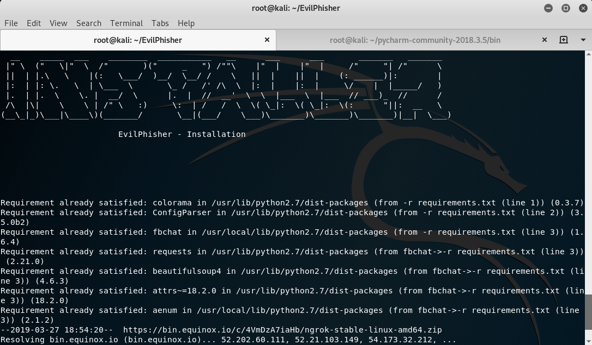
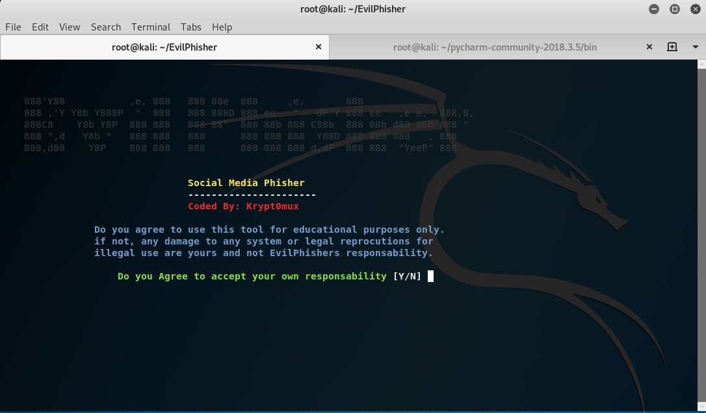
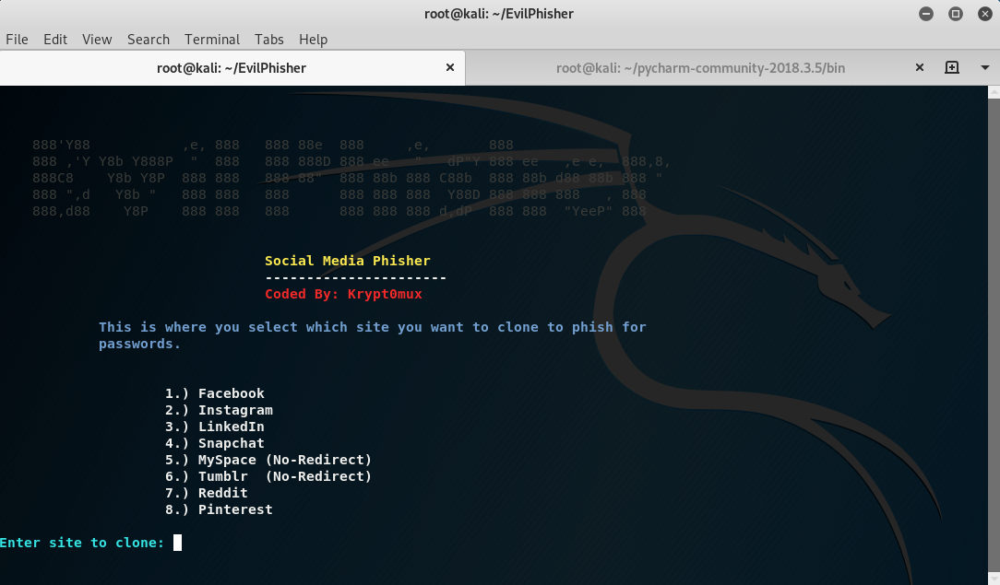
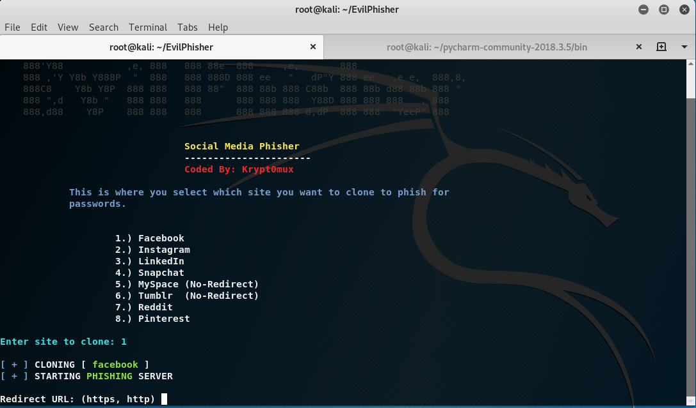
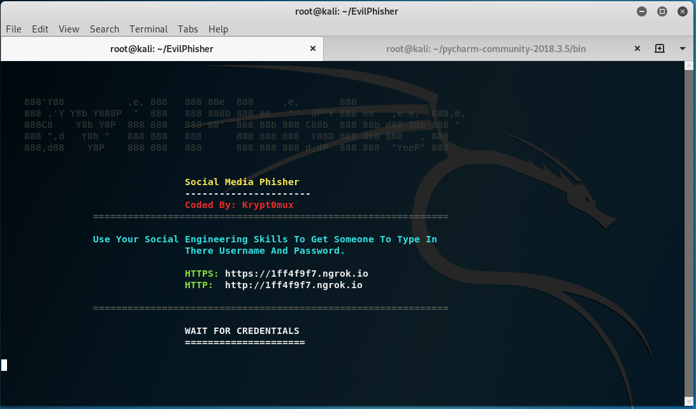
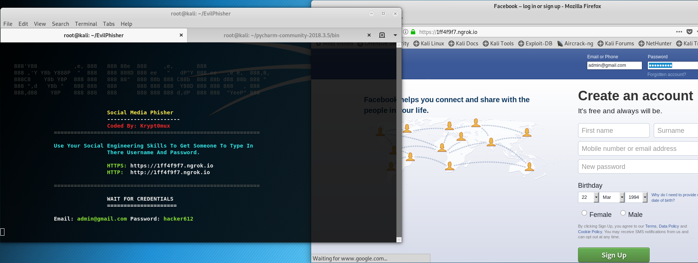

# EvilPhisher
Social Media Phisher

## Description
> EvilPhisher is a social media phishing program written in python that allows Ethical hackers to clone websites and harvest peoples passwords.

## How to install?
`git clone https://github.com/ethicalhackingplayground/EvilPhisher.git`

`python installer.py`

## How to use?
`python evilphisher.py`

## Enjoy. >:)

